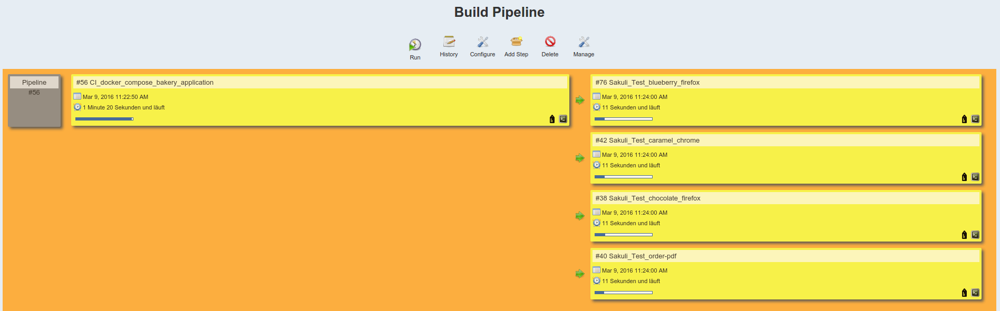

Demo Web Application "Backery"
==============================

---------

The cookie bakery demo sample application uses a multi module Maven project with each module being deployed in a separate
Docker container. The modules are:

* web
* worker
* report


Using this example with Docker
------------------------------

Lets build the
sample Docker application images by calling:

```
mvn clean package
```

Now you will be able to see some more docker images on your host.

```
docker images
```

Now you are able to lunch the application and running the Sakuli End-2-End-Tests. Therefor you have two ways to do this, using **maven** or **docker-compose**.
This may take a while when executed for the first time as Docker images will be loaded from DockerHub repository for Java,
Tomcat, ActiveMQ and so on. After that you will then see some Docker containers started on your host

```
docker ps
```

You will see Docker containers running on your host:

* bakery-web-server
* report-server
* activemq-server
* worker-chocolate
* worker-blueberry
* worker-caramel

### Using maven

To lunch the application only, just use the maven module `app-deployment-maven`:

```
mvn -f app-deployment-maven/pom.xml clean verify
```

To execute the application and the Sakuli UI test in a glance, use the maven module `sakuli-tests-maven`:

```
mvn -f sakuli-tests-maven/pom.xml clean verify
```

### Using docker-compose
To lunch the hole application from scratch you have to use the docker-compose config lying under the folder `app-deployment-docker-compose/docker-compose.yml`:

```
cd app-deployment-docker-compose
docker-compose kill && docker-compose rm -f && docker-compose build && docker-compose up -d
```

After the bakery application is fully running, you can execute the sakuli E2E tests. The docker-compose config you will find under the folder`sakuli-tests/docker-compose.yml`:

```
cd ../sakuli-tests
docker-compose kill && docker-compose rm -f && docker-compose build && docker-compose up
```

### Watch into the Sakuli-Container via VNC

Now you are able to watch the Sakuli tests running over VNC (Ports `5911 - 5914`) or over the web vnc client, open [vnc_overview_local.html](vnc_overview_local.html)


Starting the example via Jenkins CI:
------------------------------------
This example also povides an Jenkins configured CI-Job to show how easily it is to include Sakuli tests in your own CI-Build. For this go the folder `jenkins`,
start Jenkins via **docker-compose** and go to the site http://localhost:8080/.

```
cd jenkins
docker-compose kill && docker-compose rm -f && docker-compose build && docker-compose up -d
```

After the Jenkins docker-container is running, you will be able to execute the Job [CI_docker_compose_bakery_application](http://localhost:8080/job/CI_docker_compose_bakery_application/)


For better visualization, go to the view `docker-compose` and look at build pipeline. There you will see, that the job
[CI_docker_compose_bakery_application](http://localhost:8080/job/CI_docker_compose_bakery_application/) will start four sub-jobs starting with the name `Sakuli_Test*`.
As long as the `Sakuli_Test*` are running, you can take again a look into the container via the VNC overview page [vnc_overview_local.html](vnc_overview_local.html).




- - -

### Docker machine user

This sample is using Docker as infrastructure for starting up the services in separate containers. The sample application
makes use of Docker environment variables and hsit name settings that need to be set befoer using the application. Non-Linux
users might want to add dockerhost to your /etc/hosts configuration in order to simply access the
services running in Docker containers without any port forwarding:

```
echo $(docker-machine ip your-docker-machine-name) dockerhost | sudo tee -a /etc/hosts
```

In the parent Maven POM you will find properties pointing to the dockerhost.

```
<docker.host.name>dockerhost</docker.host.name>
```

You might want to adjust these properties by adding following parameters to the Maven commands shown in this readme:

```
-Ddocker.host.name=dockerHostName
```

Now you can build the Docker containers. Be sure that Docker is setup and running on your local machine.
